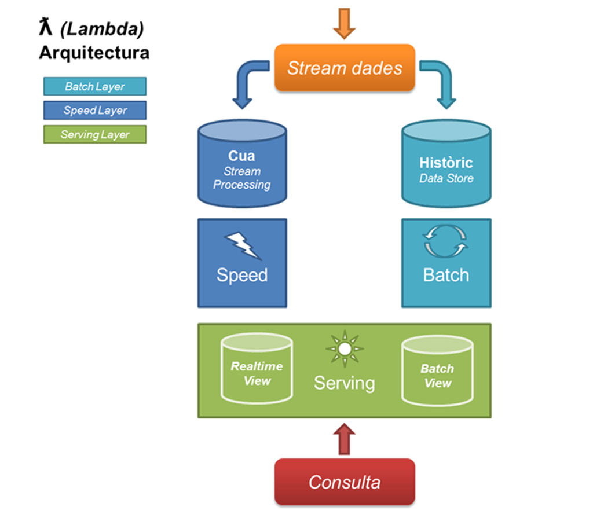
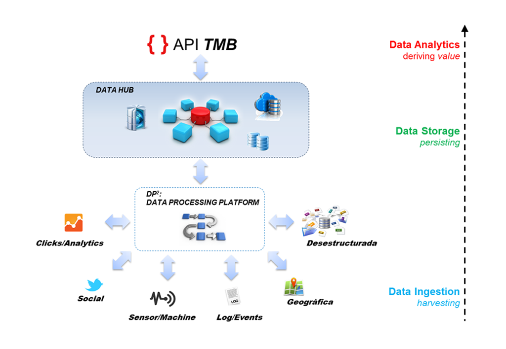
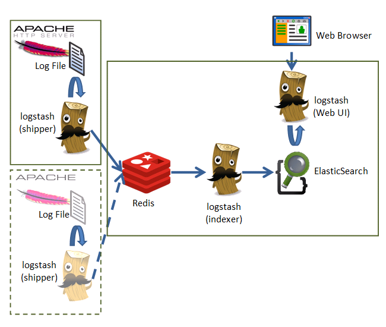
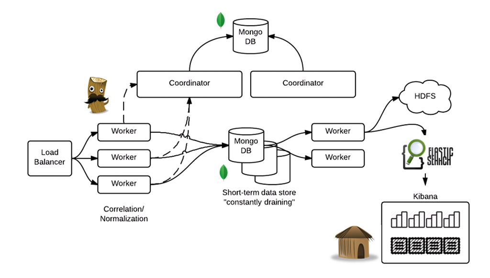
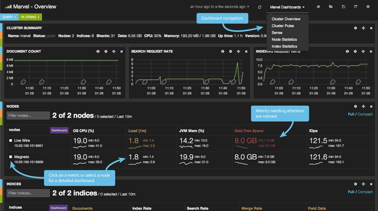
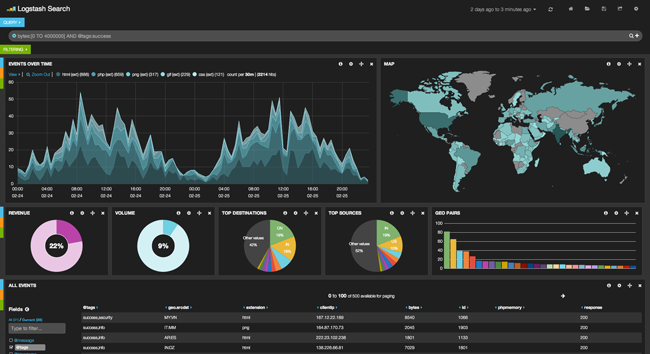
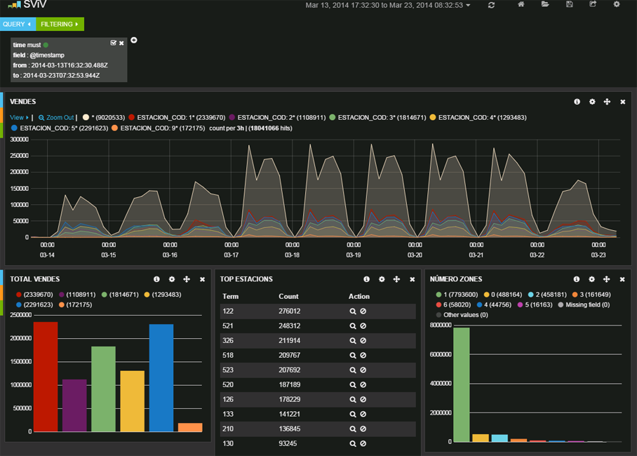
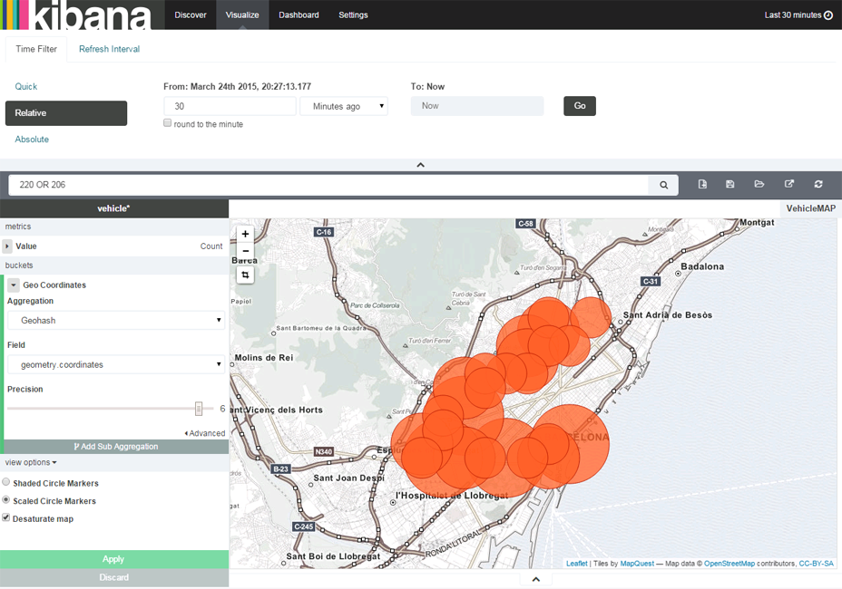
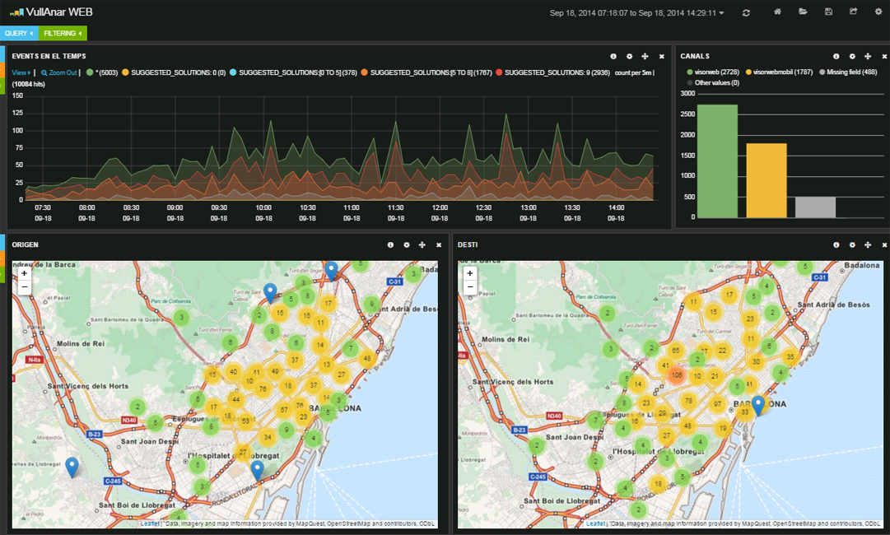
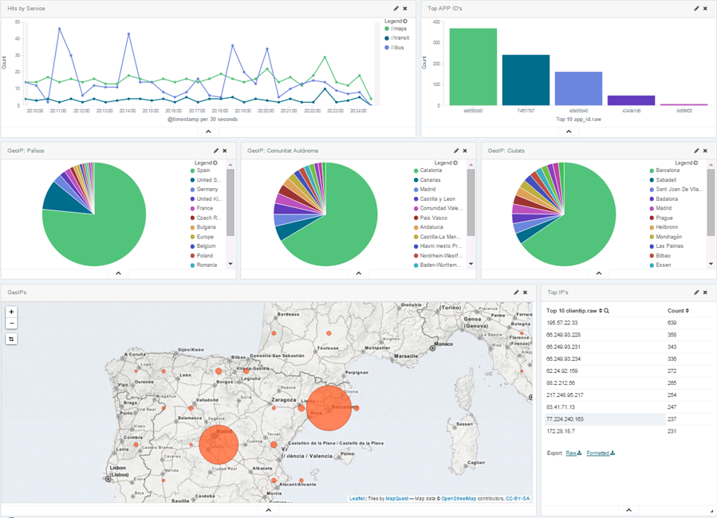

<!-- .slide: id="r2014 data-background="#FFFFFF"" -->
# TMB DataHub + DataProcessing
----------
## NoSQL Spatial Storage Stack
 
### _9as Jornadas SIG Libre_
#### On-line: <a href="http://sergioedo.github.io/workshops/" target="_blank">http://sergioedo.github.io/jsl/jsl_datahub.html</a>
 
 

#### 2015 - Eduard Porquet / Sergio Edo
 

---

# Big Data
----------
* ### ¿**Qué** es 'big'?
* ### ¿**Cómo de 'big'** es 'big'?
* ### ¿**Cuándo** se convierte en 'big'? 
* ### ¿**Dónde** reside lo 'big'?

-v-

# 3 Problemáticas
----------
* ### **V**olumen
* ### **V**elocidad
* ### **V**ariedad

-v-

# 3 Soluciones
----------
* ### Volumen >> **Procesado Batch**
<!-- .element: class="fragment" data-fragment-index="1" -->
* ### Velocidad >> **Procesado en Tiempo Real**
<!-- .element: class="fragment" data-fragment-index="2" -->
* ### Variedad >> **NoSQL**
<!-- .element: class="fragment" data-fragment-index="3" -->

-v-

# Procesado Batch
----------
* ### **Gran cantidad** de volumen
* ### Datos **estáticos**
* ### **Escalabilidad**

-v-

# Procesado en Tiempo Real
----------
* ### **Latencias bajas**
* ### Flujo de datos de entrada **contínuo**

-v-

# Procesado Híbrido
### Volumen + Velocidad
----------
* ### **Latencias bajas**
* ### **Gran cantidad** de datos en un **flujo** de entrada **contínuo**
* ### **Combinación** del procesado _Batch_ y _Tiempo Real_

---

# Big Data
### *Arquitectura Lambda*
----------
 
### http://lambda-architecture.net/

by [Nathan Marz](https://twitter.com/nathanmarz)

-v-

-v-

---

# Objetivo - Piloto
----------
 

 * ### Plataforma basada en **ELK** (ElasticSearch + Logstash + Kibana)
 * ### Forma parte del **DataHUB** de TMB (Oracle, MongoDB...)
 * ### Permite empezar a trabajar con **grandes volúmenes** de datos y **tiempo real**

-v-

# Posibles casos de uso
----------
 

* ### **Validaciones unitarias** de Metro
* ### **Posición de Autobuses** en tiempo real
* ### Visualización de **orígenes-destinos** del _Vull Anar_ (www.tmb.cat)
* ### **Origen** de accesos a los servicios y la web

---

# ELK Stack
### *Componentes*
----------
 

* ## ElasticSearch
#### Almacenamiento, Búsqueda y Escalabilidad
#### Parte del DataHUB (junto con Oracle/PostGIS y MongoDB)
* ## LogStash
#### Procesamiento, Filtrado y Transformación
#### Parte del DataProcessing (junto con Redis, servicios Nodejs, Storm y Kafka)
* ## Kibana
#### Visualizaciones / Dashboards
#### Parte de la Capa de Consulta (junto con otras aplicaciones/librerías de terceros)

-v-

## Configuración Básica
----------
  

-v-

## Configuración Ampliada
----------
 

-v-

## Configuración Avanzada
----------

---

## Logstash ##

** Ejemplo - Logs Apache **

<code>

	input {
		stdin {
			type => stdin_test
		}
	}
    
</code>
<code>

	filter {

		## LOGS APACHE
		grok {
			match => { "message" => "%{COMMONAPACHELOG}" }
		}
		
        geoip {
            source => "clientip"
        }              

        # http://www.camptocamp.com/en/actualite/logstash-devient-spatial/
        wms { }
        
		mutate {
			convert => [ "bytes", "integer" ]
			convert => [ "response", "integer" ]
		}
    
		date {
			match => [ "timestamp" , "dd/MMM/yyyy:HH:mm:ss Z" ]
		}
	}

</code>
<code>

	output {
		stdout {
			codec => rubydebug
		}
		elasticsearch {
			host => localhost 
			port => 9200
			protocol => "http"
			index => "logstash-%{+YYYY.MM.dd}"
		}
	}
	
</code>

-v-

**Ejemplo - formato CSV**

<code>

	input {
		file {
			path => [ "D:/performance_file*.txt" ]
			type => "performance"
			start_position => "beginning"
		}
	}
	
</code>
<code>

	input {
		## CSV
		csv {
			# server666;Linux Suse;kernel;performance;swap_space;5000;13/10/2014 00:00:02;Op5
			columns => ["server_name", "OS", "type", "subtype", "parameter", "value", "timestamp", "agent"]
			separator => ";"
		}

		mutate {
			convert => [ "value", "integer" ]
			add_field => [ "logtype", "MONITOR_Performance" ]
		}
		
		date {
			match => [ "timestamp" , "dd/MM/yyyy HH:mm:ss" ]
		}
	}

</code>
<code>

	output {
		stdout {
			codec => rubydebug
		}
		elasticsearch {
			host => localhost 
			port => 9200
			protocol => "http"
			index => "logstash-%{+YYYY.MM.dd}"
		}
	}
	
</code>

Más info: http://logstash.net/docs/1.4.2/

---

# ElasticSearh
----------

-v-

# Características
----------

* ### Basado en Apache Lucene
* ### API REST / JSON
* ### Schema free
* ### Distribuido (sharding)
* ### Tiempo real

-v-

# Plugins
----------
 

### **KOPF**: Permite operar el cluster, observar distribución índices
### **Marvel**: Plugin oficial (de pago), visión global del clúster
### **BigDesk**: análisis y consultas básicas
### **HQ**: Agregación de indicadores, operaciones bàsicas con índices

---

# Kibana
----------

-v-

# Validaciones unitàrias Metro
----------

-v-

# Posiciones Bus
----------

-v-

# _Vull Anar_ / Origen-Destino
----------

-v-

# Origen de accesos
----------

-v-

# Live Demos
----------
* ### http://demo.packetbeat.com/
* ### http://blog.tryolabs.com/2015/03/17/elasticsearch-demo-sf-crime-analysis-using-significant-terms/
* ### http://colors.qbox.io/

-v-

# Próximos pasos
----------------

* ### Incorporar **más piezas**: (MongoDB, Redis, Hadoop, Storm...)
* ### Poner a prueba y **aprender** (proceso iterativo)
* ### Posibilidad de **descubrir nuevos** escenarios (no planteados hasta ahora)

---

<!-- .slide: id="r2014 data-background="#FEEFAD"" -->
# Gracias por vuestra atención!
 

 
## ¿**Quién dijo BIG**?

