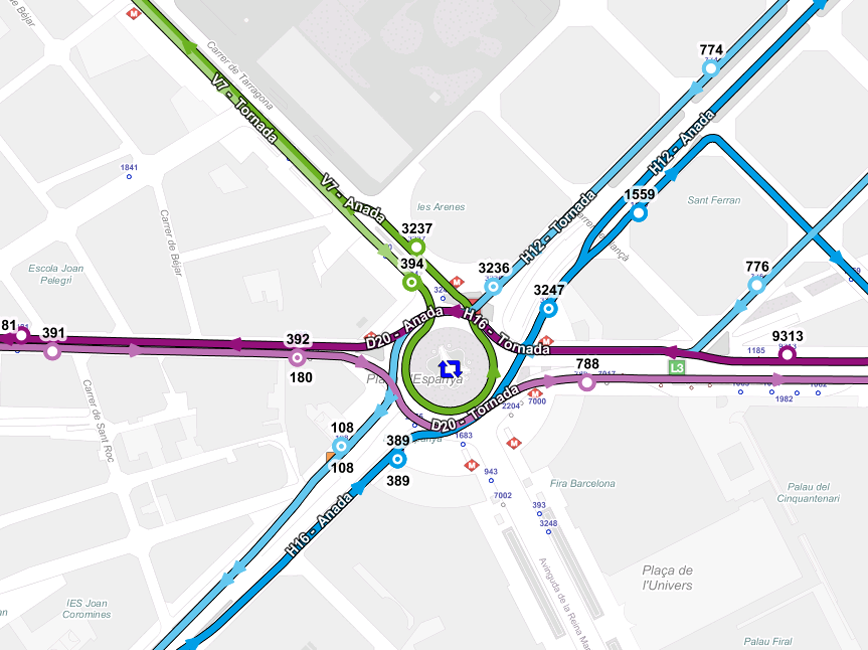

<!-- .slide: id="r2014 data-background="#FFFFFF"" -->
# Evolución del GIS en TMB
----------
 
## _9as Jornadas SIG Libre_
#### On-line: <a href="http://sergioedo.github.io/workshops/" target="_blank">http://sergioedo.github.io/jsl/jsl_tmb.html</a>
 
 

#### 2015 - Sergio Edo / Eduard Porquet
 

---

# La Empresa
----------

## _Transports Metropolitants de Barcelona_ (TMB)
 

 * ### Unión de dos empresas:
  * ### Transports de Barcelona y Ferrocarril Metropolità de Barcelona
 * ### Gestiona la red de bus y metro del _Área metropolitana de Barcelona_
  * ### Área de influencia (18 municipios)
  * ### +550 Millones de desplazamientos al año
 * ### <a href="www.tmb.cat" target="_blank">www.tmb.cat</a>

<!-- side node http://www.tmb.cat/ca/c/document_library/get_file?uuid=eea42c92-624d-44e4-b3ec-334298b6db0b&groupId=10168 -->

---

# TMB - Bus
----------
## **+100** líneas de autobús
## **+2700** paradas y **+35** áreas intercambio
 

-v-

## **+900 autobuses** en circulación diaria

-v-

## **+1000 alteraciones** y desvíos del servicio **al año**

---

# TMB - Metro
----------
## **8** líneas y **142** estaciones de Metro

-v-

## **+700** plantas de infraestructura (2.5D)

-v-

## **+100** Km de vías/túnel
## **+500K** Elementos en dependencias
  ### _Energia, seguridad, limpieza, vía, ..._

---

# Evolución del GIS
----------

-v-

# Punto de partida
----------
* ## Dos plataformas **independientes/heterogéneas**
    * ### Basadas en E$RI y Int€rgraph 
* ## Grandes problemas para **integrar** datos
<!-- .element: class="fragment" data-fragment-index="1" -->
* ## Sólo disponible para usuarios **técnicos**
<!-- .element: class="fragment" data-fragment-index="2" -->
 
* ## Punto inflexión:
<!-- .element: class="fragment" data-fragment-index="3" -->

<!-- .element: class="fragment" data-fragment-index="3" -->

-v-

# Modelo de publicación
----------

-v-

<!-- .slide: data-transition="none" -->
# Ciclo de vida
----------
### Estrategia evolución de los datos

-v-

<!-- .slide: data-transition="none" -->
# Ciclo de vida
----------
### Datos GIS - sólo geometría

-v-

<!-- .slide: data-transition="none" -->
# Ciclo de vida
----------
### Aplicar conocimiento de negocio

-v-

<!-- .slide: data-transition="none" -->
# Ciclo de vida
----------
### Enriquecer datos para publicación

-v-

<!-- .slide: data-transition="none" -->
# Ciclo de vida
----------
### Balance entre técnico y gran público

-v-

# Características
----------

* ## **Desacople** tecnológico >> nuevas herramientas
<!-- .element: class="fragment" data-fragment-index="1" -->

* ## Integra datos de **ambos sistemas**
<!-- .element: class="fragment" data-fragment-index="2" -->

* ## Enriquece/adapta para **consulta**
<!-- .element: class="fragment" data-fragment-index="3" -->

* ## Agregaciones, relaciones, simplificaciones...
<!-- .element: class="fragment" data-fragment-index="4" -->

* ## Modelo navegable >> **+Usabilidad**
<!-- .element: class="fragment" data-fragment-index="5" -->

-v-

# GeoPortal
----------

* ## NO orientado a capas
<!-- .element: class="fragment" data-fragment-index="1" -->
* ## Basado en la **navegación** (modelo de datos)
<!-- .element: class="fragment" data-fragment-index="2" -->
* ## Relaciones entre modelos (p.e. correspondencias)
<!-- .element: class="fragment" data-fragment-index="3" -->
* ## **Acercamiento** al "gran público"
<!-- .element: class="fragment" data-fragment-index="4" -->
* ## Servicios+librerías **"estándar"** >> +integración
<!-- .element: class="fragment" data-fragment-index="5" -->
 
 
_<a href="https://www.youtube.com/watch?v=FoJQLFznjCo" target="_blank">Watch video on Youtube</a>_
<!-- .element: class="fragment" data-fragment-index="5" -->

---

# Arquitectura
----------

-v-

# Productos consolidados
----------

* ## Bases de datos: **Oracle** $patial
* ## Servidor: **GeoServer** + GeoWebCache
* ## Cliente web: **GXP** (GeoExt, Ext + Openlayers)
* ## Buscador: Apache **SOLR**
* ## Rutas: **OpenTripPlanner**

-v-

# Nuevos productos...
----------

* ## MongoDB
* ## NodeJS/IOjs
* ## Openlayers 3
* ## ElasticSearch
* ## ...

-v-

# Objetivo final - Plataforma
----------

* ## Plataforma de servicios (API)
<!-- .element: class="fragment" data-fragment-index="1" -->
* ## GIS everywhere >> **more people** doing GIS
<!-- .element: class="fragment" data-fragment-index="2" -->
* ## **Acercamiento** a "desarrolladores"
<!-- .element: class="fragment" data-fragment-index="3" -->

---

<!-- .slide: id="r2014 data-background="#FEEFAD"" -->
# Gracias por vuestra atención!
 

